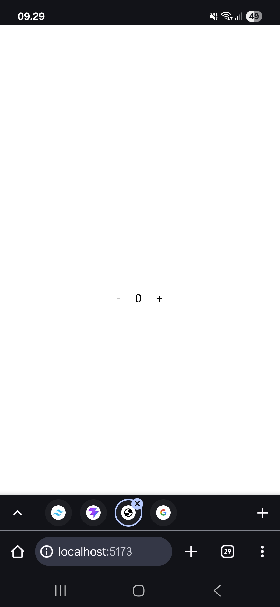

# Whta is this? 

this project is minitask for react2 to create counter number

in this repo there are 3 component that every component has their function

## view

there are two button (-) and (+) and between that buttons there is a number start with 0. 
if user click (-) button number will increase +1 until 0
but if user click (+) button the number will plus +1 until max value 10

## screenshot 

